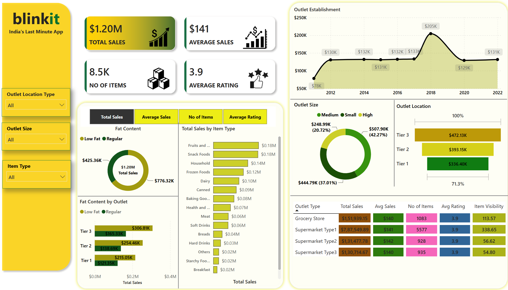

# 📊 Blinkit Sales Analytics Dashboard

## 📌 Project Overview
This Power BI dashboard analyzes Blinkit grocery sales data to uncover business insights through interactive visualizations.

## 🛠️ Tools Used
- Power BI
- Power Query
- DAX
- Microsoft Excel

## 📈 Dashboard Features
- Total Sales
- Average Sales
- Number of Items
- Average Rating
- Outlet Size Analysis
- Outlet Location Analysis
- Item Type Analysis
- Fat Content Analysis
- Interactive Filters

## 📷 Dashboard Preview

## 💡 Key Insights
- Supermarket Type1 generated the highest sales.
- Tier 3 outlets recorded the highest revenue.
- Medium-sized outlets contributed the largest sales share.
- Fruits & Vegetables and Snack Foods were among the top-selling categories.

## 📂 Files Included
- BlinkIT Sales Dashboard.pbix
- BlinkIT-Grocery-clean-data.xlsx
- dashboard.png

## 👩‍💻 Author
**Swapnali Teli**
